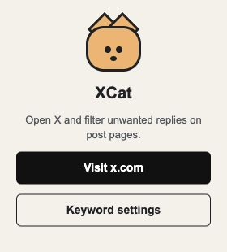
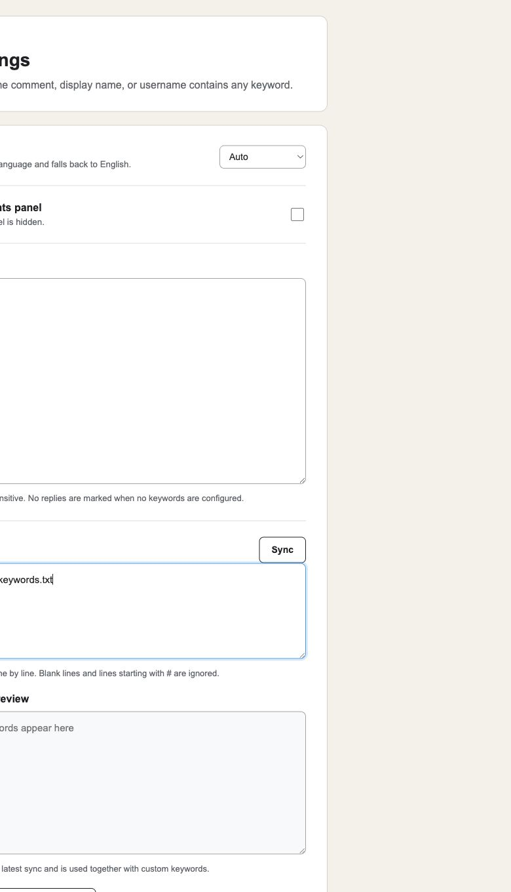

<div align="center">
  
  <h1>XCat</h1>
  <p><strong>让 X / Twitter 的评论区重新值得阅读。</strong></p>
  <p>关键词过滤 · 垃圾回复折叠 · 批量拉黑 · 评论采集</p>

  [](https://github.com/bytepengfei/xcat/releases/latest)
  [](manifest.json)
  [](#功能亮点)
</div>

XCat 是一个轻量、开源的 Chrome 扩展，用于过滤 X（Twitter）帖子下的垃圾评论、营销回复和不想看到的账号。它不会替你决定什么是垃圾内容：你可以维护自己的关键词，也可以订阅社区维护的关键词列表。

> XCat is an open-source Chrome extension for filtering spam replies on X/Twitter, reviewing matched accounts, blocking them in batches, and exporting loaded comments. The UI supports English and Chinese.

<p align="center">
  
</p>

## 为什么是 XCat？

- **干净但不打乱时间线**：命中的回复会被等高占位符折叠，滚动时不会因 X 的虚拟列表突然跳动。
- **规则完全由你控制**：支持自定义关键词和远程关键词订阅，匹配评论正文、昵称和用户名，不内置武断的黑名单。
- **拉黑前可以复核**：集中查看命中的回复，勾选后调用 X 原生操作逐个拉黑；也可在回复旁一键快速拉黑。
- **顺手采集评论**：在帖子详情页自动滚动并收集 X 已加载的评论，一键复制结构化 JSON。
- **本地优先**：设置通过 Chrome Sync/Local Storage 保存；扩展没有自建服务器，也不会把评论或账号数据上传给 XCat。

## 功能亮点

| 功能 | 你能做什么 |
| --- | --- |
| 🧹 垃圾回复过滤 | 按正文、昵称或用户名进行不区分大小写的关键词匹配 |
| 📚 关键词订阅 | 从一个或多个 URL 同步逐行关键词列表，支持 `#` 注释 |
| 🐾 垃圾回复面板 | 通过搜索框旁的猫咪按钮查看命中数量、用户和原因 |
| 🚫 批量 / 快速拉黑 | 复核后批量拉黑，或直接在单条回复旁快速操作 |
| 📥 评论采集 | 自动滚动加载评论，并复制包含账号与认证信息的 JSON |
| 🌏 双语界面 | 自动跟随 Chrome 语言，也可手动选择中文或 English |

<p align="center">
  
</p>

## 安装

### 从 Release 安装（推荐）

1. 前往 [最新版本](https://github.com/bytepengfei/xcat/releases/latest) 下载 `xcat-*.zip` 并解压。
2. 打开 `chrome://extensions`，开启右上角的 **开发者模式**。
3. 点击 **加载已解压的扩展程序**，选择刚才解压的目录。
4. 固定 XCat 到浏览器工具栏，打开 [x.com](https://x.com) 即可使用。

### 从源码安装

```bash
git clone https://github.com/bytepengfei/xcat.git
```

然后在 `chrome://extensions` 中选择本仓库目录进行加载。更新源码后，在扩展管理页点击 XCat 卡片上的刷新按钮即可。

## 快速上手

1. 点击 XCat 图标，打开 **关键词设置**。
2. 每行输入一个关键词，例如账号名、推广话术或常见诈骗文案，然后保存。
3. 如需共享规则，填入纯文本关键词列表 URL 并点击 **同步**。
4. 打开任意 X 帖子详情页。命中的回复会被折叠，右侧猫咪按钮会显示数量。
5. 在垃圾回复列表中复核并批量拉黑，或点击回复菜单旁的划线图标快速拉黑。

评论采集面板可在设置中关闭；关闭后，垃圾回复过滤和拉黑功能仍会正常工作。

## 评论 JSON

在帖子详情页点击 **Auto Scan**，XCat 会滚动页面并收集 X 已加载的回复；点击 **Copy JSON** 可复制数据。字段包括：

```json
{
  "nickname": "Display name",
  "username": "@username",
  "userInfo": {
    "profileUrl": "https://x.com/username",
    "avatarUrl": "https://...",
    "badgeLabels": ["Verified account"],
    "isVerified": true,
    "isPremium": true,
    "isPremiumPlus": false
  },
  "content": "Reply text"
}
```

X 的回复是动态加载的，因此 XCat 只能采集当前页面已经加载到 DOM 中的内容。Premium 等级来自页面可访问的标签；如果 X 没有暴露明确标签，扩展无法可靠区分 Premium 与 Premium+。

## 权限与隐私

| 权限 | 用途 |
| --- | --- |
| `storage` | 保存语言、过滤规则、订阅地址和订阅缓存 |
| `x.com` 页面访问 | 识别、折叠和采集帖子回复，并触发 X 原生拉黑操作 |
| 其他网站访问 | 仅用于从你主动添加的 HTTP(S) 地址同步关键词列表 |

XCat 不包含分析脚本、广告或远程执行代码。批量拉黑使用你当前的 X 登录会话，并按顺序调用页面中的原生 Block 控件。

## 参与贡献

欢迎提交 [Issue](https://github.com/bytepengfei/xcat/issues) 和 Pull Request。若 X 更新页面结构导致功能失效，请在 Issue 中附上复现页面、Chrome 版本和可见现象，但不要提交登录信息或私人内容。

如果 XCat 帮你找回了清爽的评论区，欢迎给仓库一个 ⭐，也可以把它分享给同样被垃圾回复困扰的人。

---

<div align="center">
  Made for a quieter X timeline 🐈
</div>
